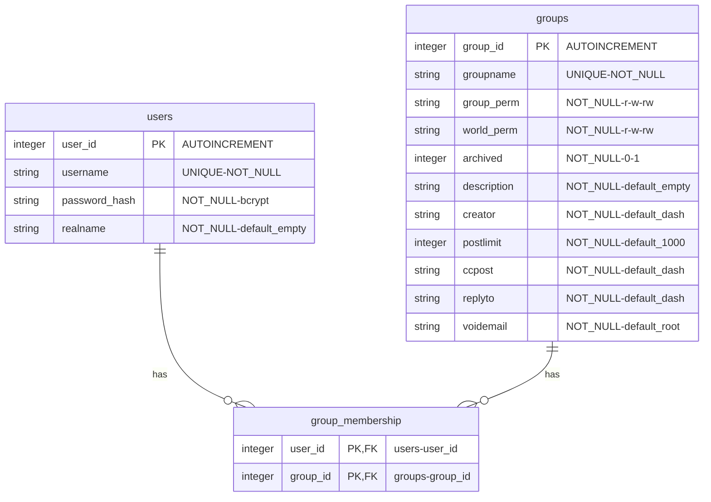

# Auth ACL Database (`auth.db`)

This document describes the **normalized SQLite schema** used by gonewsd for users, groups, and access control.


## 📊 Mermaid ER diagram



## 📑 Tables

### `users`

- **`user_id`**: integer primary key (sequential).
- **`username`**: the login name (email); must be unique.
- **`password_hash`**: bcrypt hash of the password.
- **`realname`**: optional display name (e.g. "John Doe"); default empty string.

### `groups`

- **`group_id`**: integer primary key (sequential).
- **`groupname`**: NNTP newsgroup name; must be unique.
- **`group_perm`**: permissions granted to members of the group (`r`, `w`, `rw`).
- **`world_perm`**: permissions granted to non-members (`r`, `w`, `rw`).
- **`archived`**: `0/1` flag; archived groups are treated as not accessible.
- **`description`**: free-text description of the group.
- **`creator`**: name of who created the group; default `-`.
- **`postlimit`**: maximum number of lines per posted article; default `1000`.
- **`ccpost`**: email address to CC posts to; default `-` (none).
- **`replyto`**: Reply-To address for posts; default `-` (none).
- **`voidemail`**: email for bounce messages; default `root`.

### `group_membership`

Join table connecting users to groups.

- Composite primary key **(`user_id`, `group_id`)** ensures uniqueness (no duplicates).
- Foreign keys reference `users` and `groups`.
- When a referenced user/group is removed, related membership rows are removed as well (**no dangling group info**).

### SQL to create tables
```sql
-- Enable Foreign Key support (disabled by default in SQLite)
PRAGMA foreign_keys = ON;

-- Users Table
CREATE TABLE users (
    user_id INTEGER PRIMARY KEY AUTOINCREMENT,
    username TEXT UNIQUE NOT NULL,
    password_hash TEXT NOT NULL,
    realname TEXT NOT NULL DEFAULT ''
);

-- Groups Table
CREATE TABLE groups (
    group_id INTEGER PRIMARY KEY AUTOINCREMENT,
    groupname TEXT UNIQUE NOT NULL,
    group_perm TEXT NOT NULL,
    world_perm TEXT NOT NULL,
    archived INTEGER NOT NULL DEFAULT 0 CHECK (archived IN (0, 1)),
    description TEXT NOT NULL DEFAULT '',
    creator TEXT NOT NULL DEFAULT '-',
    postlimit INTEGER NOT NULL DEFAULT 1000,
    ccpost TEXT NOT NULL DEFAULT '-',
    replyto TEXT NOT NULL DEFAULT '-',
    voidemail TEXT NOT NULL DEFAULT 'root'
);

-- Junction Table for Many-to-Many Relationship
CREATE TABLE group_membership (
    user_id INTEGER,
    group_id INTEGER,
    PRIMARY KEY (user_id, group_id),
    FOREIGN KEY (user_id) REFERENCES users (user_id) ON DELETE CASCADE,
    FOREIGN KEY (group_id) REFERENCES groups (group_id) ON DELETE CASCADE
);
```

## 🔍 How access checks work

- When a user authenticates, gonewsd loads their memberships from `group_membership`.
- For a given group:
  - If the user is a member, `group_perm` controls access.
  - If the user is not a member, `world_perm` controls access.
  - If `archived=1`, access is denied.

All groups are defined in the `groups` table (no "spool-only" groups). The server only lists and serves groups that exist in the DB.


